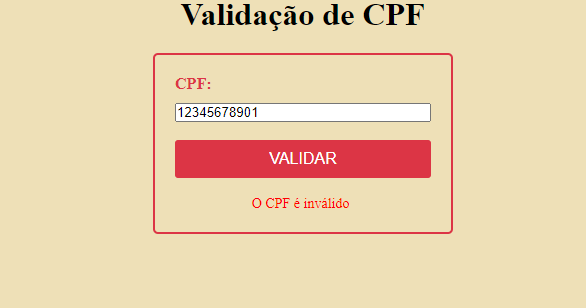
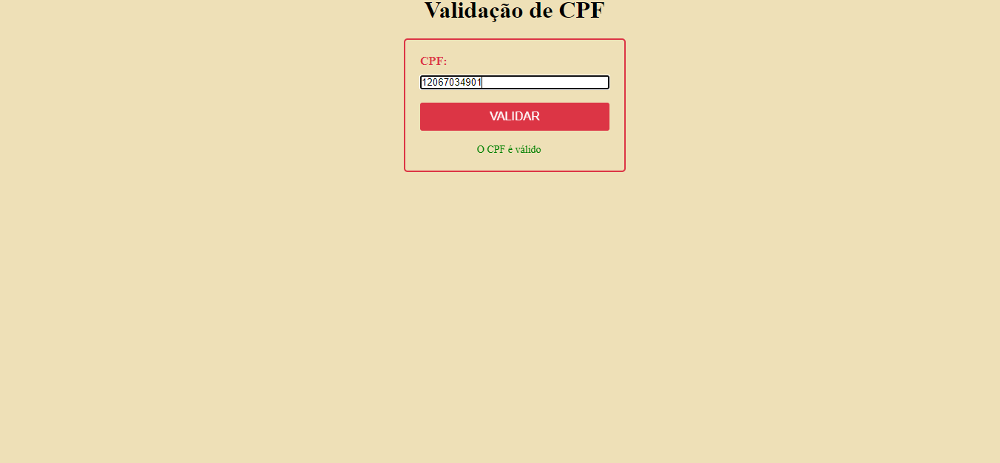
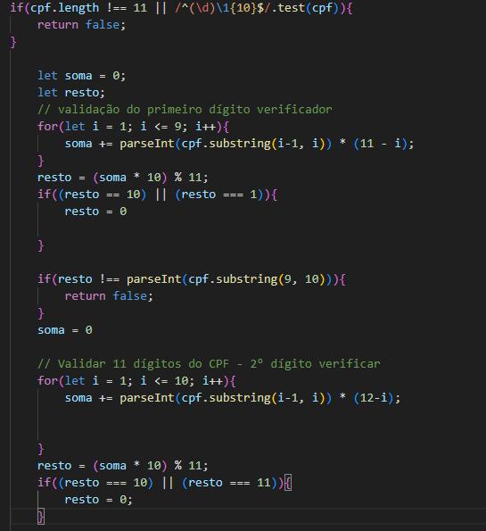
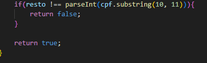
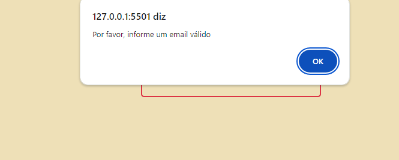

# VALIDAÇÃO DE EMAIL E CPF

* Desenvolvemos esta funcionalidade utilizando JavaScript para garantir que os usuários preencham corretamente todos os campos obrigatórios. Caso algum campo seja preenchido de forma inadequada, um alerta será exibido solicitando que o usuário corrija as informações fornecidas.
* ## CPF

* ## Mas como isso ocorre?

Quando o resto da divisão na validação do CPF é 10 ou 11, o dígito verificador correspondente deve ser ajustado para 0. Isso ocorre porque, segundo as regras de validação do CPF, esses valores de resto não são utilizados diretamente como dígitos verificadores. Em vez disso, são tratados como 0.

Caso o resto for 10 ou 11: De acordo com a regra de validação, esses valores são convertidos para 0, garantindo que o cálculo do dígito verificador esteja de acordo com o padrão estabelecido.
 
Quando não informamos o CPF correto ex: quando falta números, se colocarmos letras ou o cálculo não correnponder ao o CPF válido.
 # Caso o CPF não esteja correto aparecerá um spam informando o usuario sobre o ocorrido 
* 

* ## Assim que informarem um CPF correto o spam vai aparecer validando.

* 

* ## Essa é a parte do código reponsável dos cálculos pela válidação 
* 

# Email
* No Email acontece praticamente a mesma coisa, a diferença está no código e na forma em que vai aparecer na página do site. 
* Se não informamos o texto certo depois do (@) ou deixar incompleto aparecerá erro 

